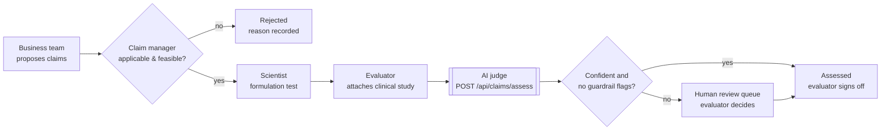
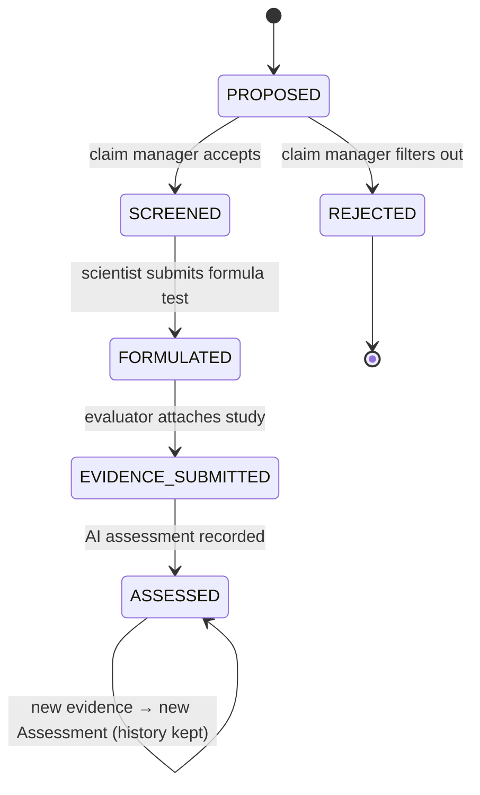

# 1. Business process understanding

## The problem in one paragraph

A cosmetic claim such as *"Reduces wrinkles by 20% in 4 weeks"* is a legal promise. In the EU it must be backed by evidence held in the product's safety file, and in the US an objective claim needs competent and reliable scientific evidence. Every number in the sentence (20%, 4 weeks) and every word (*reduces* vs *visibly reduces the appearance of*) changes what evidence is required. Today an evaluator reads a clinical study report and checks it against the claim by hand. That is slow, varies between evaluators, and the reasoning is rarely captured in a structured, searchable way. The Claims Intelligence Engine gives the evaluator a first-pass, explainable judgement and records it for audit.

## Actors and the flow from the brief

| # | Actor | What they do | System touchpoint |
|---|---|---|---|
| 1 | **Business / marketing team** | Proposes a product with one or more claims of different types (efficacy, consumer perception, sensory, "free from"…) | `Claim` created, status `PROPOSED` |
| 2 | **Claim manager** | Filters each claim for applicability (is it allowed in this market / category?) and feasibility (can we realistically prove it?) | `SCREENED` or `REJECTED` |
| 3 | **Scientist (Paris R&I)** | Formulates the product and runs formulation tests, submits the formula in support of the claim | `FORMULATED` |
| 4 | **Evaluator** | Runs or commissions the clinical / instrumental study and attaches the results | `EVIDENCE_SUBMITTED` |
| 5 | **AI judge + evaluator** | The engine assesses whether the evidence justifies the exact claim wording; the evaluator confirms or overrides | `ASSESSED` (+ human-review flag) |

### Claim lifecycle (implemented as `ClaimStatus`)

A rejected claim cannot be assessed (the API returns `409 Conflict`). That is a small example of the workflow being enforced in the backend, not just in the UI.

## Where the AI fits, and where it must not

The brief places the LLM at step 5. I treat it as a **decision-support tool for the evaluator, not an approver**:

- It produces a verdict, a confidence score, reasoning, and a per-criterion breakdown the evaluator can check in under a minute.
- Every result below a confidence threshold, every "not enough evidence" result, and every case where deterministic checks disagree with the model is flagged for human review.
- Every result is stored with the model, prompt version and input hash, so it can be explained later to a regulator or an internal auditor.

## What "justified" actually means — the decomposition I used

Reading the claim *"Reduces wrinkles by 20% in 4 weeks"* as a checklist:

| Part of the claim | Question the evidence must answer |
|---|---|
| *Reduces wrinkles* | Was an objective wrinkle endpoint measured (depth, volume, count by 3D imaging / profilometry / expert grading)? Self-perception supports "looks/feels" wording only. |
| *by 20%* | Did the **panel mean** reach ≥ 20%, versus baseline and ideally versus vehicle? Not just the best responders. |
| *in 4 weeks* | Is there a measurement at or before day 28? Data at week 8 does not support a 4-week claim. |
| (implicit) | Controlled / randomised / blinded design, statistical significance, relevant panel size and population, and the tested formula is the one being sold. |

These six criteria became the rubric in the prompt, the `criteria` JSON on each assessment, and the checklist in the UI.

## Pain points the solution addresses

1. **Consistency.** Two evaluators can read the same study differently. A shared rubric plus a recorded AI first pass narrows that spread.
2. **Throughput.** Many claims per product, many products per year. A first pass in seconds lets evaluators spend their time on the hard cases.
3. **Traceability.** The reasoning behind an approved claim is usually buried in email or a PDF. Here it is structured, versioned and queryable.
4. **Early warning.** Wording that the evidence can't carry (*"in 4 weeks"* when data is at 8) is caught before packaging and media are produced.

## Assumptions I made (and would validate with the business)

- The evidence arrives as a text summary of the study. Full PDF reports are a roadmap item.
- One claim is assessed against one evidence pack at a time; a claim can have many assessments over time.
- The target market changes the regulatory frame, so it is captured on the claim (default EU).
- The AI never auto-approves for publication; an evaluator always signs off.

## Questions I would ask the stakeholders

- What does the evaluator's current checklist look like, and can we use their past decisions as a gold-standard test set?
- What confidence level would the business accept for "fast-track" versus "full review"?
- Are clinical reports allowed to leave the company network (data residency, contractual limits with CROs)? This decides between a public API, an EU-hosted cloud model, or a self-hosted model.
- Who is accountable when the evaluator disagrees with the AI — and should that disagreement feed back into improving the prompt?
- Which markets are in scope first? US, EU and China have meaningfully different claim rules.
