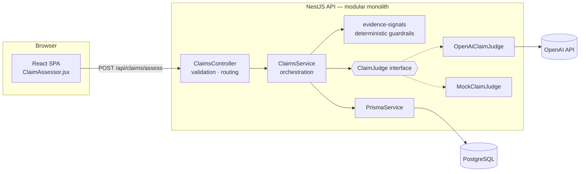
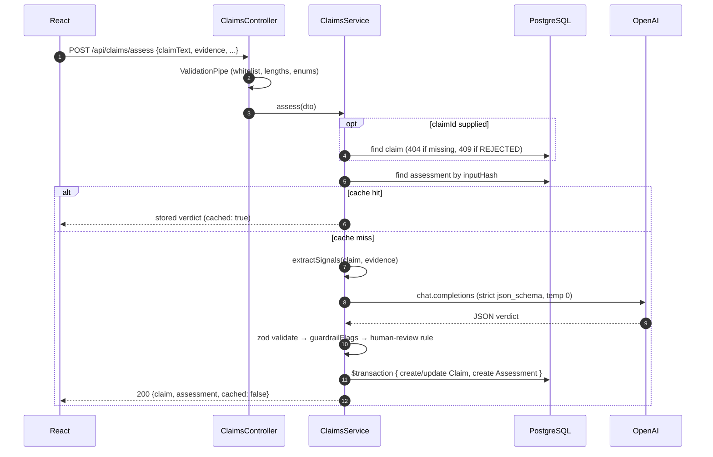

# 3. Technical architecture and justification

## 3.1 System overview



| Layer | Responsibility | Key file |
|---|---|---|
| UI | Collect claim + evidence, show verdict, confidence, reasoning | `apps/web/src/components/ClaimAssessor.jsx` |
| Controller | HTTP only: routes, DTO validation, status codes | `claims.controller.ts` |
| Service | The use case: load claim → cache → signals → judge → guardrails → persist | `claims.service.ts` |
| Judge | Provider-agnostic interface; OpenAI and mock implementations | `llm/claim-judge.interface.ts` |
| Guardrails | Regex extraction + cross-checks, independent of the LLM | `claims/evidence-signals.ts` |
| Data | Prisma 7 (Rust-free client, `pg` adapter) | `prisma/schema.prisma` |

## 3.2 The request, step by step



Two ordering decisions worth calling out:

1. **Fail fast before spending money.** The claim is loaded and validated, and the cache checked, *before* the LLM is called.
2. **Never hold a DB transaction across a network call.** The LLM call (seconds) happens outside the transaction; only the two writes are atomic. If the LLM fails, nothing is written and the client gets a `502`.

## 3.3 API contract

`POST /api/claims/assess`

```json
{
  "claimText": "Reduces wrinkles by 20% in 4 weeks",
  "productName": "Night Renewal Serum (RX-204)",
  "category": "EFFICACY",
  "market": "EU",
  "evidence": "Randomised, double-blind, vehicle-controlled ... D28 -23.4% (p<0.001)"
}
```

Or `{ "claimId": "<uuid>", "evidence": "..." }` to assess a claim already in the workflow.

Response `200`:

```json
{
  "claim": { "id": "…", "claimText": "…", "status": "ASSESSED", "...": "…" },
  "assessment": {
    "justified": true,
    "verdict": "JUSTIFIED",
    "confidenceScore": 0.88,
    "reasoning": "…",
    "supportingPoints": ["…"],
    "gaps": [],
    "criteria": { "endpoint_match": "MET", "magnitude": "MET", "timepoint": "MET", "study_design": "MET", "statistics": "MET", "population": "MET" },
    "guardrailFlags": [],
    "requiresHumanReview": false,
    "provider": "openai", "model": "gpt-4o-mini", "promptVersion": "claims-judge/2026-10-06.1",
    "latencyMs": 2140, "createdAt": "…", "id": "…"
  },
  "cached": false
}
```

| Status | When |
|---|---|
| 400 | Validation failed (missing/too long fields, unknown fields) |
| 404 | `claimId` does not exist |
| 409 | Claim was rejected at screening |
| 502 | LLM unavailable or returned unusable output after retry |

Also: `GET /api/claims` (register), `GET /api/claims/:id` (full assessment history), `GET /api/health`.

## 3.4 Data model decisions

- **Claim 1 → N Assessment, append-only.** A new study or a new prompt version creates a new row; nothing is overwritten. That is the audit trail a regulated process needs.
- **Three-state verdict + derived boolean.** `verdict` keeps nuance; `isJustified` serves the UI's Yes/No and simple reporting queries.
- **Provenance columns** (`provider`, `model`, `promptVersion`, tokens, latency, `rawResponse`) make every verdict reproducible and every cost attributable.
- **`inputHash`** gives idempotency without a separate cache store.
- **`criteria` as JSONB** — the rubric will evolve; a JSON column avoids a migration per criterion while still being queryable in Postgres.
- **Indexes** on `status`, `(claimId, createdAt)`, `inputHash`, `requiresHumanReview` match the actual query paths (register, history, cache, review queue).

## 3.5 Key design decisions (ADR summary)

| # | Decision | Alternatives | Trade-off accepted |
|---|---|---|---|
| 1 | Modular monolith in NestJS | Microservices | One deployable is right for an MVP; module boundaries (`claims`, `llm`, `prisma`) allow extraction later. |
| 2 | `ClaimJudge` interface + DI factory | Call OpenAI directly in the service | A few extra lines; in exchange, provider swap, offline demo and trivial unit testing. |
| 3 | Structured Outputs + zod | Prompt "please return JSON" | Ties the OpenAI path to models that support `json_schema`; model is configurable. |
| 4 | Hybrid guardrails that *flag*, never *override* | Let rules override the LLM | Rules are brittle on free text; flagging keeps humans in charge without silently trusting either side. |
| 5 | Confidence used for routing only | Show it as a probability | Honest about calibration limits; threshold is configurable. |
| 6 | Synchronous endpoint | Queue + polling/SSE | Simple now; the service has no HTTP dependencies, so it can run in a worker later unchanged. |
| 7 | Vite dev proxy for `/api` | CORS everywhere | Same-origin in dev and behind a gateway in prod; CORS kept configurable. |

## 3.6 Non-functional concerns

**Security**
- OpenAI key lives only on the server (`.env`, never sent to the browser); `.env` is git-ignored.
- `ValidationPipe` with `whitelist` + `forbidNonWhitelisted`, field length limits, 100 kB body cap.
- Prompt-injection mitigations (delimiters, untrusted-data instruction, detection + forced review).
- Data protection: clinical study summaries may be confidential. For production I would use an enterprise endpoint with zero data retention or an EU-hosted model (e.g. Azure OpenAI in an EU region), which the `ClaimJudge` interface makes a configuration change.
- Next: SSO (OIDC / Entra ID) and role-based access matching the four business roles, rate limiting (`@nestjs/throttler`), secrets from a vault.

**Reliability**
- SDK retries with backoff for 429/5xx, plus one application retry for invalid output; auth/bad-request errors are not retried.
- Timeouts configurable (`OPENAI_TIMEOUT_MS`).
- Failures map to clear HTTP codes; no partial writes.

**Scalability**
- The API is stateless → horizontal scaling behind a load balancer.
- The real bottleneck is LLM latency and rate limits, not the database. Path: queue (BullMQ/Redis or a cloud queue) + worker pool sized to the provider's rate limits, results pushed via SSE/WebSocket.
- The cache absorbs duplicate submissions.

**Observability**
- Structured log line per assessment (verdict, confidence, provider/model, latency, review flag).
- Token counts stored per assessment → cost per claim, per product, per month with a SQL query.
- `/api/health` reports DB status and the active judge.
- Next: OpenTelemetry traces across API → LLM → DB, dashboards for latency, error rate, review rate and evaluator-override rate.

**Testability**
- 22 unit tests, no database or API key needed: signal extraction, schema validation, OpenAI request/ retry/refusal handling, and the service's business rules (cache, 404, 409, 502 with no writes, human-review routing, guardrails).
- CI (GitHub Actions): install → generate Prisma client → typecheck → test → build → dependency audit.

## 3.7 What I would change with more time (honest limitations)

- Regex extraction is English-only and heuristic; it is a cross-check, not a source of truth.
- The confidence score is not yet calibrated against real evaluator decisions.
- No authentication yet — every user can assess any claim.
- Evidence is text-only; real study reports are PDFs with tables and figures.
- `npm audit` reports high-severity advisories in transitive dependencies of the Prisma **CLI** (e.g. `mysql2`, `deepmerge-ts`). They are build-time tooling only, not in the API's runtime path, and the only offered fix is a major downgrade; I'd track the upstream fix rather than downgrade.
- The full workflow screens for each role (business, claim manager, scientist) are modelled in the data but not built in the UI.
