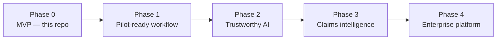

# 4. Product roadmap — with ample time and no boundaries

The MVP answers one question: *does this evidence justify this claim?* The long-term product answers a bigger one: *which claims can we make, in which markets, and what evidence do we need to make them?*

## Phase 0 — MVP (done)

Claim + evidence → structured LLM verdict with confidence and reasoning, deterministic guardrails, human-review routing, append-only audit trail, offline mock mode, tests and CI.

## Phase 1 — Pilot-ready workflow (≈ 1–2 months)

Goal: one real team uses it for real claims.

- **Identity and roles:** SSO (OIDC / Entra ID); roles for business, claim manager, scientist, evaluator, admin; claim-level permissions.
- **Full workflow UI:** a screen per role matching the `ClaimStatus` lifecycle — propose, screen (with reason codes), attach formula test, attach study, assess.
- **Evaluator decision capture:** accept / override the AI verdict with a reason. This is the single most valuable data the product will ever collect.
- **Document ingestion:** upload study PDFs; extract text, tables and figures; store originals in object storage with checksums.
- **Async processing:** queue + workers, live status updates in the UI, retry and dead-letter handling.
- **Review queue:** list of assessments with `requiresHumanReview`, sorted by deadline.
- **Production hygiene:** rate limiting, secrets in a vault, enterprise / EU-hosted model endpoint, structured logs and traces.

## Phase 2 — Trustworthy AI (≈ 2–4 months)

Goal: prove the AI is good enough, and keep it that way.

- **Golden evaluation set:** past claims with the evaluator's final decision. Every prompt or model change runs against it in CI; regressions block the release.
- **Prompt registry:** prompts as versioned artifacts with change history, A/B rollout and rollback.
- **Confidence calibration:** map model confidence to observed agreement with evaluators, so "80%" really means about 8 in 10.
- **Multi-model consensus:** run two different models on high-stakes claims; disagreement goes to a human.
- **Market-aware rules:** EU, US, UK, China, India rule packs — wording that is acceptable in one market can be prohibited in another.
- **RAG over internal knowledge:** internal claim guidelines, accepted method lists per claim type, and past substantiation dossiers as retrievable context, with citations in the reasoning.
- **Explainability:** link each reasoning sentence to the exact passage in the study that supports it (highlighted in the UI).

## Phase 3 — Claims intelligence (≈ 4–9 months)

Goal: move from checking claims to shaping them.

- **Claim wording assistant:** *"Your evidence supports 'visibly reduces the appearance of wrinkles in 4 weeks', not 'reduces wrinkles by 20%'."* Suggest the strongest claim the evidence actually carries.
- **Study design advisor:** before a study is commissioned, recommend endpoints, panel size, timepoints and controls needed for the intended claim — avoiding studies that can't support the claim marketing wants.
- **Claim portfolio analytics:** which claims are most often rejected and why; time from proposal to approval; cost per substantiated claim; evidence reuse across products.
- **Multilingual claims:** assess translated pack copy per market, catching wording drift in translation.
- **Competitive and regulatory watch:** monitor regulator decisions and advertising-standards rulings, and flag existing claims affected by new rulings.

## Phase 4 — Enterprise platform

- Integrations with PLM (formula data), LIMS (lab results), CRO portals (study reports) and DAM / packaging systems (where approved claims go).
- Event-driven architecture (claim and assessment events) so downstream systems react automatically.
- Kubernetes deployment with GitOps, policy-as-code, SAST/DAST/SCA in the pipeline, SBOMs, and per-region data residency.
- Audit export packaged for regulatory inspection: claim, evidence, every assessment, every human decision, with timestamps and versions.

## How I would measure success

| Metric | Why it matters |
|---|---|
| Agreement rate between AI verdict and evaluator's final decision | Core quality signal; target set with the business after the pilot |
| Evaluator override rate, by reason | Where the prompt or rules need work |
| Time from evidence submitted to decision | The throughput benefit |
| Share of assessments routed to human review | Too high = no time saved; too low = possible over-trust |
| Claims challenged after launch | The outcome the whole system exists to reduce |
| LLM cost per assessed claim | Keeps the business case honest |
